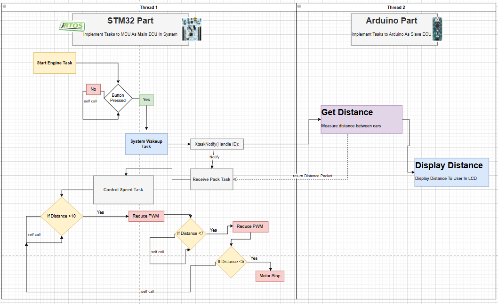

# Adaptive Cruise Control System  

## Overview  
An advanced system that uses STM32F446RE with FreeRTOS and Arduino Nano to implement Adaptive Cruise Control (ACC) functionality.  

---

## System Design  
- **STM32F446RE (Master ECU):** Operates with FreeRTOS for real-time task management.  
- **Arduino Nano (Slave ECU):** Operates in BareMetal mode for efficient communication and data processing.  

---

## Flow Chart  
  

---

## Features  
- **High Determinism and Responsiveness:** Ensured through FreeRTOS capabilities.  
- **User Interface:** Displays distance in real-time on an LCD screen.  
- **Safety Enhancement:** Dynamically adjusts vehicle behavior based on distance measurements.  

---

## How It Works  
1. STM32F446RE manages overall system tasks and communicates with sensors and the Arduino Nano.  
2. Arduino Nano processes specific tasks like data acquisition and feedback control.  
3. The system dynamically adjusts speed or triggers a warning based on distance measurements.  

---

## Benefits  
- Enhances road safety.  
- Reduces driver fatigue during long journeys.  
- Provides a user-friendly interface with real-time feedback.  

## Analysis
- Start System
  

- Distance More 10 
  

- Distance Less 10 
  

- Distance Less 7 
  

- Distance Less 5  -> System Stop
  

## CPU Load

  